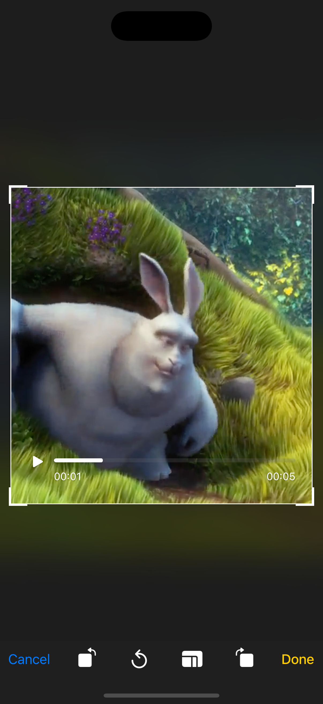
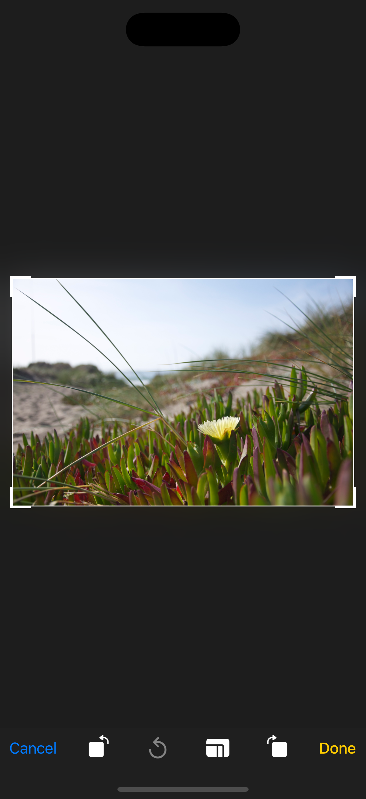

# ImageVideoCropper

iOS library extended from TOCropViewController to add the support for the video cropper functionality

## ✨ Features

- Crop image 
- Crop Video

## 📦 Installation

Use Swift Package Manager:

1. In Xcode, go to `File > Add Packages...`
2. Enter this repository URL: https://github.com/harikrishnabista7/ImageVideoCropper

**Usage**

To crop video
``` Swift
import ImageVideoCropper

let cropper = HBCropViewController(videoURL: videoURL)
cropper.delegate = self
present(cropper, animated: true)

```

To crop image
``` Swift
import ImageVideoCropper

let cropper = HBCropViewController(image: image)
cropper.delegate = self
present(cropper, animated: true)

```
 


